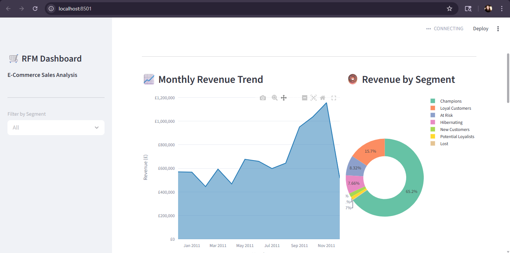

 E-Commerce Sales & Customer Segmentation (RFM Analysis)

 📊 Dashboard Preview



---

Business Problem

E-commerce companies generate massive transaction data but often struggle to identify high-value customers and reduce churn.

This project aims to answer:

* Who are the most valuable customers?
* Which customers are at risk of churn?
* How can businesses improve retention and revenue?

---

Project Overview

This is an end-to-end data analysis project that explores e-commerce sales data to extract business insights and perform customer segmentation using RFM (Recency, Frequency, Monetary) analysis.

The project combines **Python, SQL, and dashboarding** to simulate real-world business analytics workflows.

---

Objectives

* Analyze sales trends and revenue patterns
* Identify top-performing products and regions
* Understand customer purchase behavior
* Segment customers using RFM analysis
* Build an interactive dashboard for visualization

---

Tech Stack

* Python (Pandas, NumPy, Matplotlib, Seaborn)
* SQL (Aggregation, Joins, Group By)
* Streamlit (Dashboard Development)
* Excel Dataset

---

Project Structure

```
ecommerce-rfm-analysis/
│
├── data/
│   └── processed/
│       ├── rfm_data.csv
│       └── rfm_segments.csv
│
├── notebooks/
│   └── eda.ipynb
│
├── sql/
│   └── queries.sql
│
├── visuals/
│   └── charts/
│       └── dashboard.png
│
├── src/
│   └── dashboard.py
│
└── README.md
```

---

Data Cleaning & Preprocessing

* Removed missing Customer IDs
* Filtered invalid transactions (negative quantity/price)
* Removed duplicates
* Converted date columns
* Created **Revenue column**

---

Exploratory Data Analysis (EDA)

* Monthly revenue trends
* Country-wise performance
* Top-selling products
* Customer-level behavior

---

SQL Analysis

SQL was used to extract business insights directly from transaction data.

Example Query:

```sql
SELECT Country, SUM(Quantity * Price) AS Revenue
FROM retail
GROUP BY Country
ORDER BY Revenue DESC;
```

More queries available in `sql/queries.sql`.

---

RFM Analysis (Core Feature)

RFM is a widely used customer segmentation technique based on:

* **Recency** → Days since last purchase
* **Frequency** → Number of purchases
* **Monetary** → Total spending

Customers were scored and segmented into:

* VIP Customers
* Loyal Customers
* At-Risk Customers
* Regular Customers

---

 Key Findings

* A small percentage of customers contribute the majority of revenue (Pareto effect)
* Customers with low recency show high churn risk
* Loyal customers generate consistent repeat revenue
* Certain regions dominate overall sales performance

---

Dashboard

An interactive Streamlit dashboard was built to visualize:

* Sales trends
* Customer segmentation
* Revenue distribution

---

Business Recommendations

* Target VIP customers with loyalty programs
* Re-engage at-risk customers with discounts
* Focus marketing on high-performing regions
* Improve retention strategies for long-term growth

---

Dataset Note

Large raw datasets are excluded due to GitHub file size limits.
Processed datasets are included for analysis.

---

How to Run

pip install -r requirements.txt
streamlit run src/dashboard.py

---

Future Improvements

* Customer churn prediction (Machine Learning)
* Sales forecasting
* Cloud deployment

---

Conclusion

This project demonstrates strong skills in data cleaning, analysis, SQL querying, customer segmentation, and dashboard development — aligning with real-world Data Analyst responsibilities.

---

👤 Author

**Naincy Tiwari**
